# Evaluating Structural vs. Semantic Control in Image Diffusion

This repository contains the full project pipeline for studying control trade-offs in image diffusion with:

- `ControlNet (Canny)` for structural control
- `IP-Adapter` for semantic / appearance control
- hard time-step switching
- smooth time-step scheduling
- conflict-paired evaluation on a curated COCO subset

The codebase started from the midway milestone, so the package directory is still named `midway_project`, but it now includes the final-stage experiments and reporting code.

## Environment

The project was developed and validated in:

```powershell
C:\Users\hanfield\anaconda3\envs\neuro\python.exe
```

Install the package in editable mode:

```powershell
C:\Users\hanfield\anaconda3\envs\neuro\python.exe -m pip install -e .
```

## Reproducible Pipeline

Download the required local model weights:

```powershell
C:\Users\hanfield\anaconda3\envs\neuro\python.exe scripts\download_assets.py
```

Prepare the fixed `1000`-sample COCO subset:

```powershell
C:\Users\hanfield\anaconda3\envs\neuro\python.exe scripts\prepare_coco_subset.py --subset-size 1000
```

Run the midway baselines:

```powershell
C:\Users\hanfield\anaconda3\envs\neuro\python.exe scripts\run_baselines.py --manifest assets\data\coco2017_midway\subset_manifest.csv --resume
```

Run the hard-switch search on the conflict subset:

```powershell
C:\Users\hanfield\anaconda3\envs\neuro\python.exe scripts\run_combined_experiments.py --manifest assets\data\coco2017_midway\subset_manifest.csv --sample-size 100 --pairing conflict --experiment-name search_100_conflict --resume
```

Run the smooth-schedule search:

```powershell
C:\Users\hanfield\anaconda3\envs\neuro\python.exe scripts\run_smooth_schedule_search.py --manifest assets\data\coco2017_midway\subset_manifest.csv --sample-size 100 --pairing conflict --experiment-name search_100_conflict_smooth --resume
```

Run the final full-set confirmation and export the final notebook / figures:

```powershell
C:\Users\hanfield\anaconda3\envs\neuro\python.exe scripts\run_final_experiments.py --manifest assets\data\coco2017_midway\subset_manifest.csv --device cuda --resume
```

If you only need to rebuild the final summary notebook from finished outputs:

```powershell
C:\Users\hanfield\anaconda3\envs\neuro\python.exe scripts\build_final_results_notebook.py --hard-search-root outputs\combined_experiments\search_100_conflict --smooth-search-root outputs\combined_experiments\search_100_conflict_smooth --final-root outputs\combined_experiments\final_eval_1000_conflict --figures-dir figures\final_stage
```

## Main Artifacts

Final report notebook:

- `notebooks/final_results.ipynb`

Midway notebook:

- `notebooks/midway_results.ipynb`

Final-stage figures:

- `figures/final_stage/schedule_overview.png`
- `figures/final_stage/hard_search_tradeoff.png`
- `figures/final_stage/smooth_search_tradeoff.png`
- `figures/final_stage/hard_vs_smooth_tau_metrics.png`
- `figures/final_stage/smooth_sharpness_metrics.png`
- `figures/final_stage/final_method_bars.png`
- `figures/final_stage/selected_slide_cases_curated/comparisons/`
- `figures/final_stage/selected_slide_cases_curated/tau_sweeps/`
- `figures/final_stage/final_method_gallery.png`

Final summary files:

- `outputs/combined_experiments/final_eval_1000_conflict/search_summary.csv`
- `outputs/combined_experiments/final_eval_1000_conflict/pairwise_summary.csv`
- `outputs/combined_experiments/final_eval_1000_conflict/per_sample_metrics.csv`

## Visual Summary

GitHub can render repository images directly inside the README, so the most important final-stage plots are embedded below.

<p align="center">
  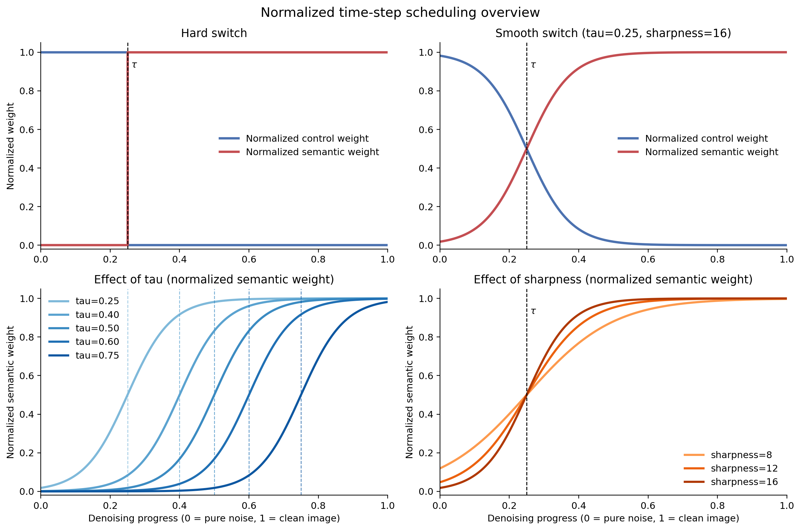
</p>

<p align="center">
  <em>Time-step scheduling overview. Hard switch uses a step function at <code>tau</code>; smooth scheduling replaces the step with a sigmoid transition. In this normalized illustration, <code>tau</code> marks the transition center in time, while <code>sharpness</code> controls how abrupt the transition is around that center.</em>
</p>

<p align="center">
  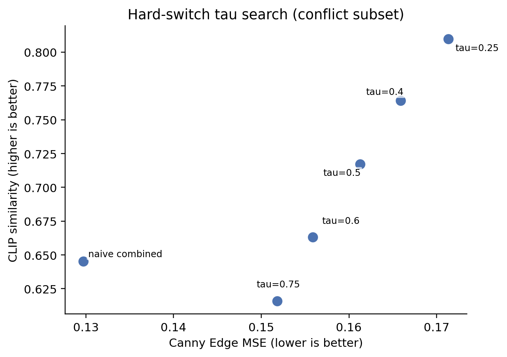
</p>

<p align="center">
  <em>Hard-switch search on the conflict subset. Smaller <code>tau</code> favors semantic alignment, while larger <code>tau</code> preserves structure more strongly.</em>
</p>

<p align="center">
  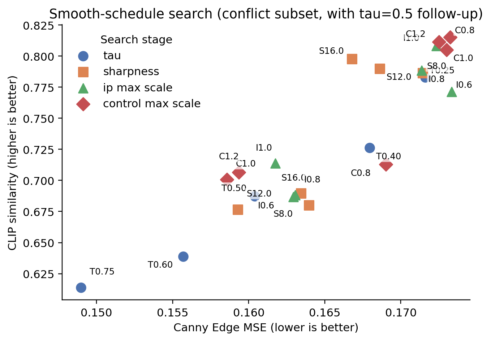
</p>

<p align="center">
  <em>Smooth-schedule search on the conflict subset. The plot shows how changing <code>tau</code>, <code>sharpness</code>, and scale settings moves the method along the same structure-versus-semantics frontier.</em>
</p>

<p align="center">
  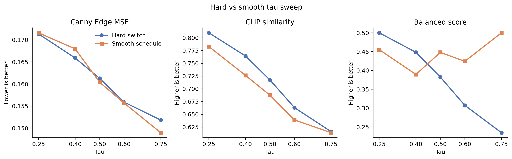
</p>

<p align="center">
  <em>Matched-<code>tau</code> comparison between hard and smooth schedules. This plot shows whether smoothing creates a better compromise or simply moves along the same structure-versus-semantics trade-off curve.</em>
</p>

<p align="center">
  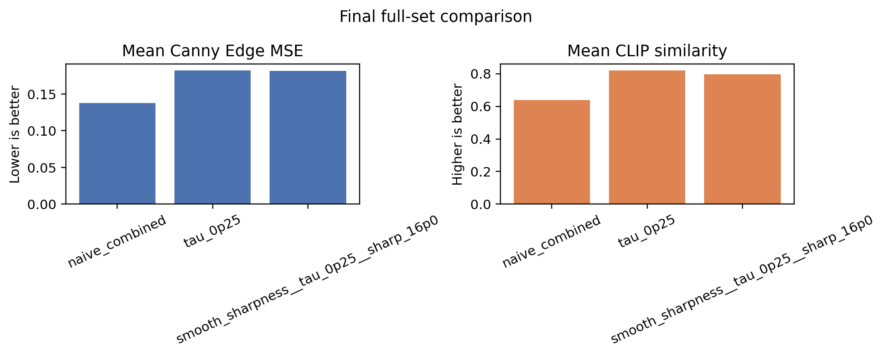
</p>

<p align="center">
  <em>Full-set comparison on 1,000 conflict pairs. Lower Canny Edge MSE means better structure preservation; higher CLIP similarity means better semantic alignment.</em>
</p>

## Curated Slide Cases

The slide-case export is now fully hard-coded in [scripts/export_selected_slide_candidates.py](scripts/export_selected_slide_candidates.py). There is no runtime lookup logic: the exact `sample_id` for each case is fixed in code, and the README below renders those same curated outputs directly.

For each case:

- `Comparison`: `Edge Map | Image Ref | Naive | Hard (tau=0.25) | Smooth`
- `Tau Sweep`: `Edge Map | Image Ref | Naive | tau=0.25 | tau=0.40 | tau=0.50 | tau=0.60 | tau=0.75`

### Color Cases

#### `000000322895__000000254516`


#### `000000190923__000000047010`

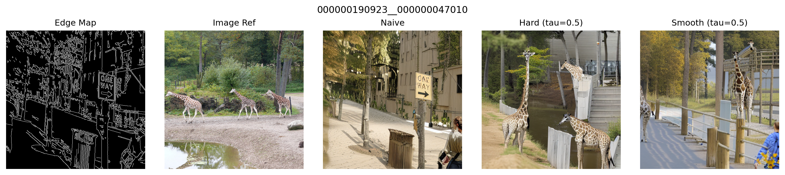
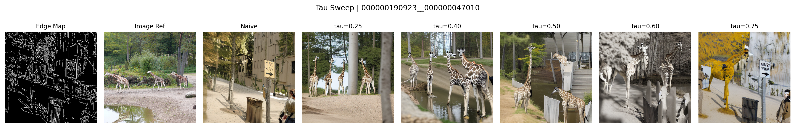

#### `000000377575__000000085157`

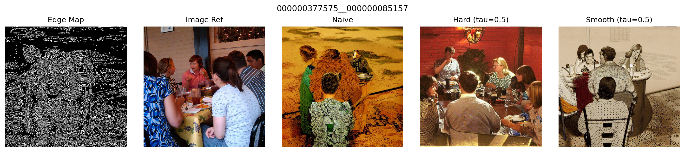
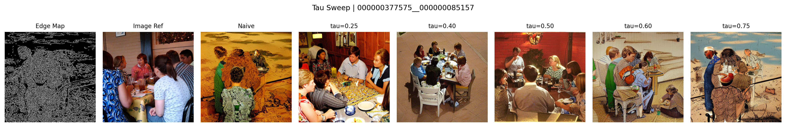

#### `000000148730__000000394940`

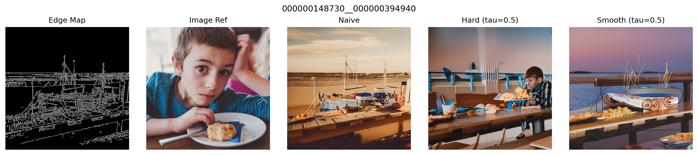
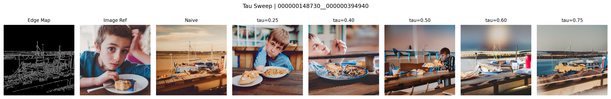

#### `000000336232__000000109976`

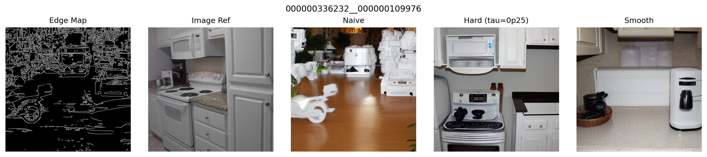
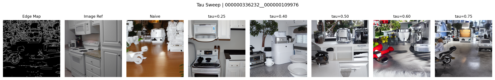

#### `000000085682__000000187734`

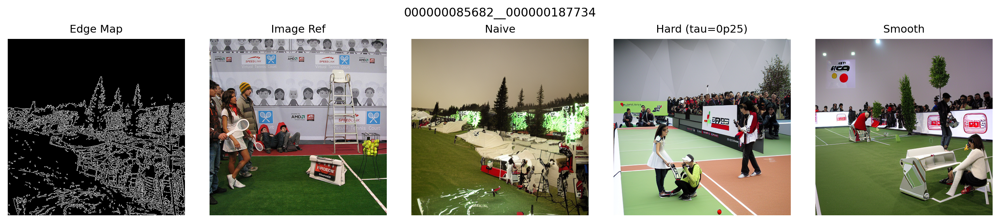
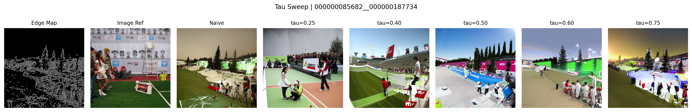

### Artifacts / Cleanup Cases

#### `000000017959__000000198915`

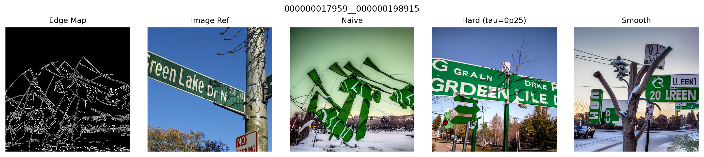
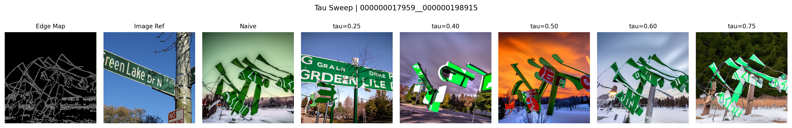

#### `000000491613__000000475191`

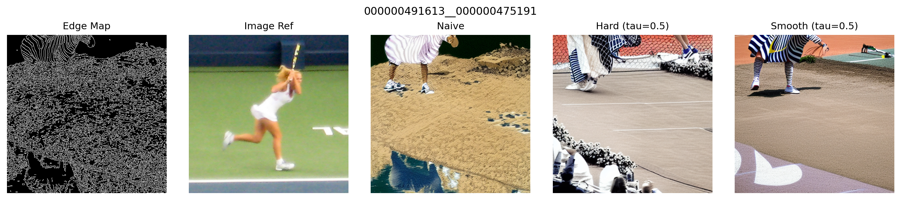
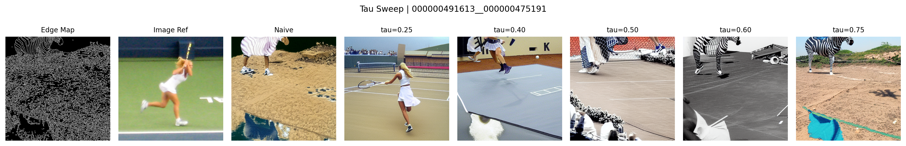

#### `000000492077__000000189226`

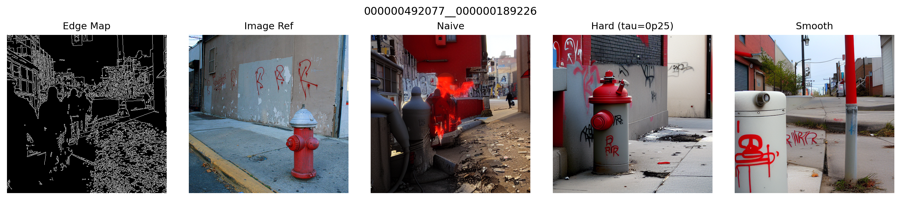
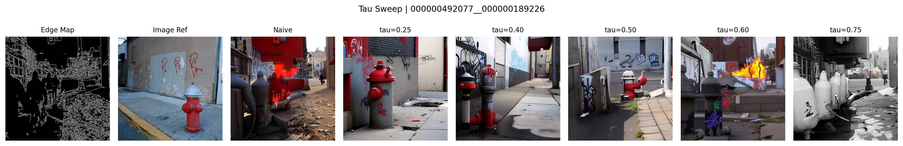

#### `000000364322__000000343934`

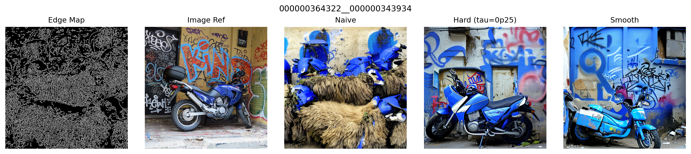
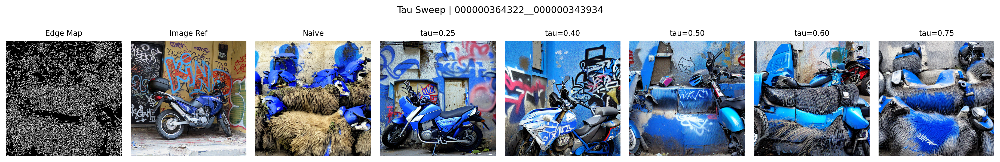

#### `000000322895__000000254516`

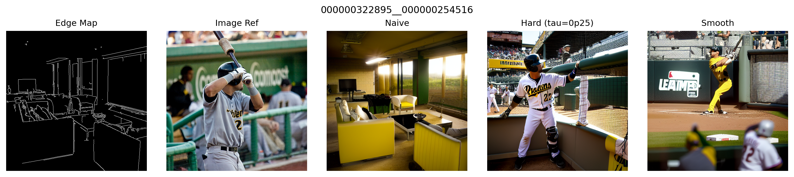
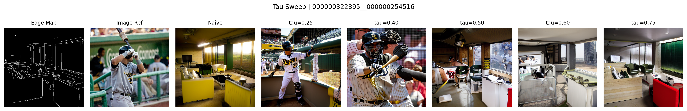

#### `000000328286__000000307145`

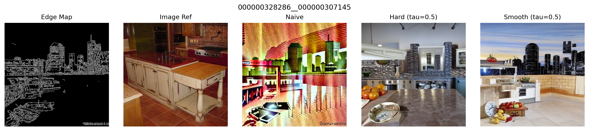
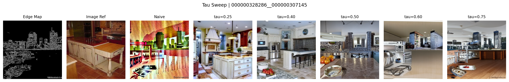

#### `000000001993__000000050165`

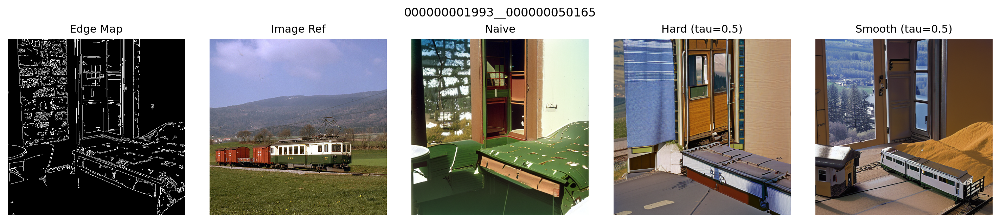
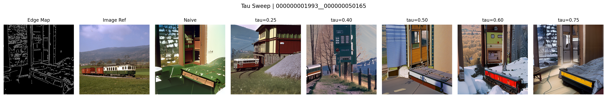

#### `000000476787__000000280779`

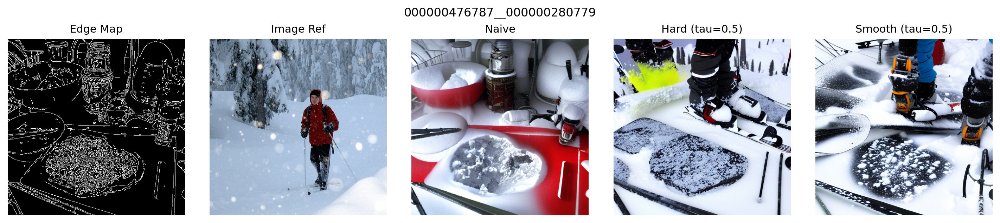
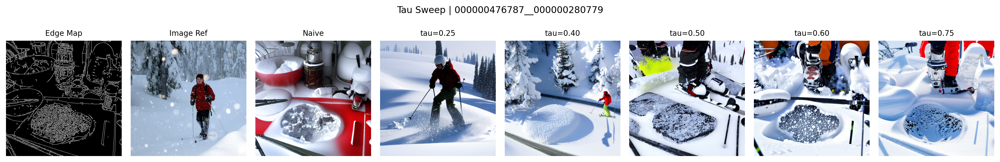

## Current Result Snapshot

Final full-set comparison on `1000` conflict pairs:

- `naive_combined`: best structure  
  `Canny MSE mean = 0.1375`, `CLIP similarity mean = 0.6382`
- `tau_0p25`: best semantics  
  `Canny MSE mean = 0.1820`, `CLIP similarity mean = 0.8195`
- `smooth_sharpness__tau_0p25__sharp_16p0`: slightly smoother compromise than hard scheduling at the same `tau`, but not a Pareto improvement over the hard result  
  `Canny MSE mean = 0.1818`, `CLIP similarity mean = 0.7974`

Pairwise comparison against `naive_combined`:

- `tau_0p25` wins on CLIP similarity for `96.6%` of samples, but wins on Canny MSE for only `8.2%`
- `smooth_sharpness__tau_0p25__sharp_16p0` wins on CLIP similarity for `94.6%` of samples, but wins on Canny MSE for only `7.3%`

This means the final experiments expose a clear structure / semantics trade-off rather than a schedule that dominates both objectives at once.

## Repository Layout

- `src/midway_project/`: reusable pipeline, scheduling, metrics, and final-stage analysis code
- `scripts/`: command-line entry points for data prep, searches, final evaluation, monitoring, and notebook export
- `notebooks/`: midway and final summary notebooks
- `figures/final_stage/`: exported final plots used in the notebook and paper
- `outputs/combined_experiments/`: summary CSV / JSON outputs for hard, smooth, and final evaluations
- `main.tex`: paper source
- `references.bib`: bibliography
